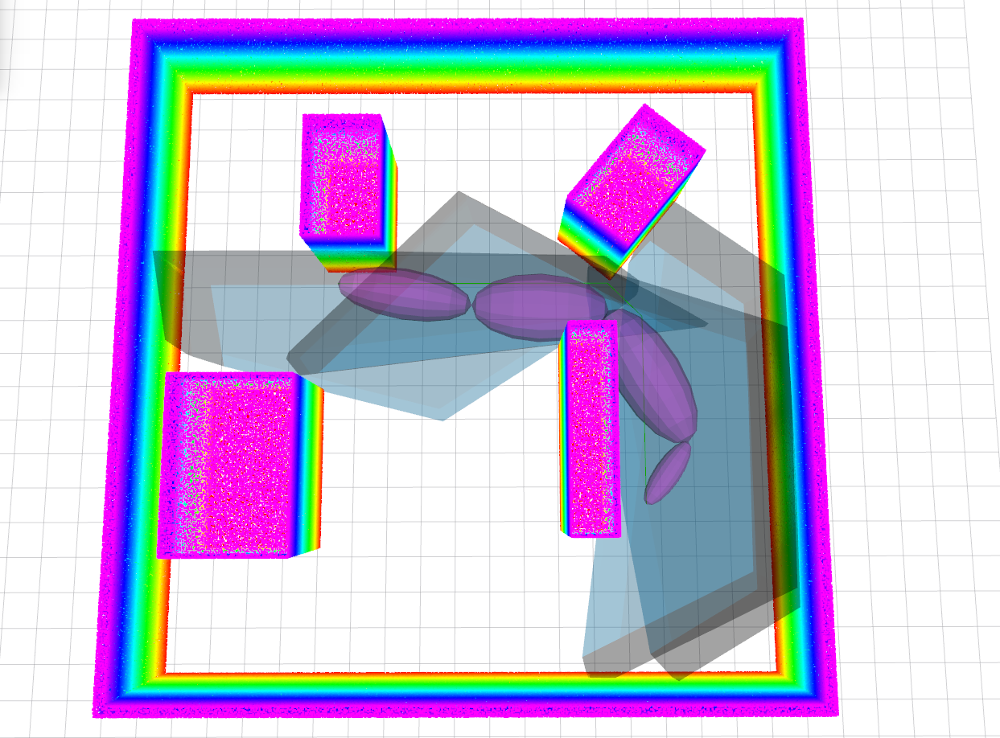
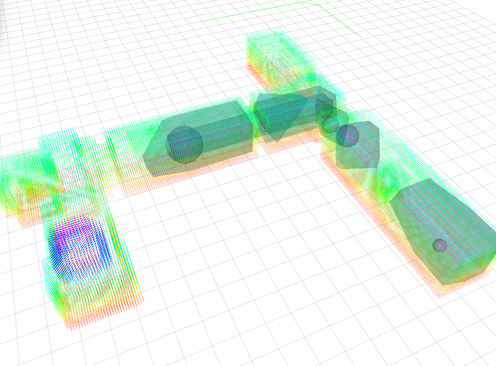

# MRSL Decomputil Library
[](https://app.wercker.com/project/byKey/89a66f8c94c00db95dc056bae099adb3)
- - -
Fast convex decomposition in point cloud. In the basic pipeline, it implements ellipsoid based regional inflation to model free space from a given path inside a point cloud.
Detials of the algorithm is proposed in ["S. Liu, M. Watterson, K. Mohta, K. Sun, S. Bhattacharya, C.J. Taylor and V. Kumar. Planning Dynamically Feasible Trajectories for Quadrotors using Safe Flight Corridors in 3-D Complex Environments. ICRA 2017"](http://ieeexplore.ieee.org/document/7839930/).

## Compilation
#### A) Simple cmake
```sh
$ mkdir build && cd build && cmake .. && make
```

#### B) Using CATKIN (not recognizable by catkin\_make)
```sh
$ cd mv decomp_util ~/catkin_ws/src
$ cd ~/catkin_ws & catkin_make_isolated -DCMAKE_BUILD_TYPE=Release
```

#### Include in other projects:
To link this lib properly, add following in the `CMakeLists.txt`
```
find_package(decomp_util REQUIRED)
include_directories(${DECOMP_UTIL_INCLUDE_DIRS})
...
add_executable(test_xxx src/test_xxx.cpp)
target_link_libraries(test_xxx ${DECOMP_UTIL_LIBRARIES})

```

## Example
The output from `EllipseDecomp` or `IterativeDecomp` can be visualized with ROS Rviz:

 


## Doxygen
For more details, please refer to https://sikang.github.io/DecompUtil/index.html

## ROS
The ROS wrapper for easier use of this package can be found in [`DecompROS`](https://github.com/sikang/DecompROS.git).
