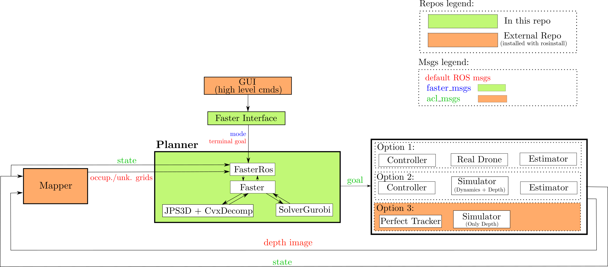

# FASTER: Fast and Safe Trajectory Planner for Flights in Unknown Environments #


**Finalist to the Best Paper Award on Safety, Security, and Rescue Robotics (IROS 2019)**

UAV               |  Ground Robot           | 
:-------------------------:|:-------------------------:|
[](https://www.youtube.com/watch?v=fkkkgomkX10 "IROS 2019: FASTER: Fast and Safe Trajectory Planner for Flights in Unknown Environments")      |  [](https://youtu.be/L13k44-krcc "IROS 2019: FASTER: Fast and Safe Trajectory Planner for Flights in Unknown Environments") |  
[](https://www.youtube.com/watch?v=fkkkgomkX10 "IROS 2019: FASTER: Fast and Safe Trajectory Planner for Flights in Unknown Environments")       |  [](https://www.youtube.com/watch?v=fkkkgomkX10 "IROS 2019: FASTER: Fast and Safe Trajectory Planner for Flights in Unknown Environments")    |  

## Citation

When using FASTER, please cite this paper ([conference version](https://arxiv.org/abs/1903.03558), [journal version](https://arxiv.org/abs/2001.04420), [video](https://www.youtube.com/watch?v=gwV0YRs5IWs)):

```bibtex
@inproceedings{tordesillas2019faster,
  title={{FASTER}: Fast and Safe Trajectory Planner for Flights in Unknown Environments},
  author={Tordesillas, Jesus and Lopez, Brett T and How, Jonathan P},
  booktitle={2019 IEEE/RSJ International Conference on Intelligent Robots and Systems (IROS)},
  year={2019},
  organization={IEEE}
}

```


## General Setup
FASTER has been tested with 
* Ubuntu 16.04/ROS Kinetic  
* Ubuntu 18.04/ROS Melodic 

Other ROS versions may require some minor changes, feel free to [create an issue](https://github.com/mit-acl/faster/issues) if you have any problems. The Gurobi versions tested are Gurobi 8.1 and Gurobi 9.0.

Install the [Gurobi Optimizer](https://www.gurobi.com/products/gurobi-optimizer/). You can test your installation typing `gurobi.sh` in the terminal. Have a look at [this section](#issues-when-installing-gurobi) if you have any issues.

Install the following dependencies:
```
sudo apt-get install ros-"${ROS_DISTRO}"-gazebo-ros-pkgs ros-"${ROS_DISTRO}"-mavros-msgs ros-"${ROS_DISTRO}"-tf2-sensor-msgs
```
```
python -m pip install pyquaternion
```

Create a workspace, and clone this repo and its dependencies:
```
mkdir ws && cd ws && mkdir src && cd src
git clone https://github.com/mit-acl/faster.git
wstool init
wstool merge ./faster/faster/install/faster.rosinstall

```

If you are using Gurobi X.Y instead of Gurobi 9.0, you should change the name `libgurobi90.so` to `libgurobiXY.so` in the [CMakeLists.txt](https://github.com/mit-acl/faster/blob/master/faster/CMakeLists.txt).

In the following, remember (once the workspace is compiled) to add this to your `~/.bashrc`:
```
source PATH_TO_YOUR_WS/devel/setup.bash
``` 

### Instructions to use FASTER with an aerial robot:

Compile the code:

```
wstool update -j8
cd ..
catkin config -DCMAKE_BUILD_TYPE=Release
catkin build
```

And finally open 5 terminals and execute these commands:
```
roslaunch acl_sim start_world.launch
roslaunch acl_sim perfect_tracker_and_sim.launch
roslaunch global_mapper_ros global_mapper_node.launch
roslaunch faster faster_interface.launch
roslaunch faster faster.launch
```
Now you can click `Start` in the GUI, and then, in RVIZ, press `G` (or click the option `2D Nav Goal` on the top bar of RVIZ) and click any goal for the drone. 

### Instructions to use FASTER with a ground robot:

Install the following dependencies:
```
sudo apt-get install ros-"${ROS_DISTRO}"-control-toolbox ros-"${ROS_DISTRO}"-ros-control ros-"${ROS_DISTRO}"-robot-localization ros-"${ROS_DISTRO}"-lms1xx ros-"${ROS_DISTRO}"-interactive-marker-twist-server ros-"${ROS_DISTRO}"-hector-gazebo-plugins ros-"${ROS_DISTRO}"-move-base ros-"${ROS_DISTRO}"-ros-control ros-"${ROS_DISTRO}"-ros-controllers ros-"${ROS_DISTRO}"-pointgrey-camera-description ros-"${ROS_DISTRO}"-hardware-interface ros-"${ROS_DISTRO}"-message-to-tf ros-"${ROS_DISTRO}"-gazebo-ros-control
```
Then download the ground_robot-specific packages and compile the repo:

```
wstool merge ./faster/faster/install/faster_ground_robot.rosinstall
wstool update -j8
cd ..
catkin config -DCMAKE_BUILD_TYPE=Release
catkin build
```


Then, in [`faster.yaml`](https://github.com/mit-acl/faster/tree/master/faster/param), change these parameters:
```
drone_radius: 0.5  #[m]

z_max: 0.5         #[m] 

v_max: 1.4         #[m/s]  
a_max: 1.4         #[m/s2] 
j_max: 5.0         #[m/s3]

is_ground_robot: true  
```

And finally open 4 terminals and execute these commands
```
roslaunch faster ground_robot.launch
roslaunch global_mapper_ros global_mapper_node.launch quad:=JA01
roslaunch faster faster_interface.launch quad:=JA01 is_ground_robot:=true
roslaunch faster faster.launch quad:=JA01
```

Now you can click `Start` in the GUI, and then, in RVIZ, press `G` (or click the option `2D Nav Goal` on the top bar of RVIZ) and click any goal for the ground robot. 


## Architecture:


 

For the aerial robot, the option 3 is provided (a perfect tracker and a Gazebo simulation to obtain the depth). To make the simulation faster, the physics engine of Gazebo is disabled using [`disable_physics.cpp`](https://gitlab.com/mit-acl/lab/acl-gazebo/-/blob/master/acl_sim/src/disable_physics.cpp) of [`acl-gazebo`](https://gitlab.com/mit-acl/lab/acl-gazebo).

For the ground robot, the option 2 is provided (a controller, and a Gazebo simulation with both dynamics and depth (using the `multi_jackal` package)


## Credits:
This package uses code from the [JPS3D](https://github.com/KumarRobotics/jps3d) and [DecompROS](https://github.com/sikang/DecompROS) repos (included in the `thirdparty` folder), so credit to them as well. 


## Issues when installing Gurobi:

If you find the error:
```
“gurobi_continuous.cpp:(.text.startup+0x74): undefined reference to
`GRBModel::set(GRB_StringAttr, std::__cxx11::basic_string<char,
std::char_traits<char>, std::allocator<char> > const&)'”
```
The solution is:

```bash
cd /opt/gurobi800/linux64/src/build  #Note that the name of the folder gurobi800 changes according to the Gurobi version
sudo make
sudo cp libgurobi_c++.a ../../lib/
```

## Issues with other possible errors:

You can safely ignore these terminal errors:
* `Error in REST request` (when using ROS Melodic)
* `[ERROR] [...]: GazeboRosControlPlugin missing <legacyModeNS> while using DefaultRobotHWSim, defaults to true.` (when using the ground robot)
* `[ERROR] [...]: No p gain specified for pid.  Namespace: /gazebo_ros_control/pid_gains/front_left_wheel.` (when using the ground robot)
