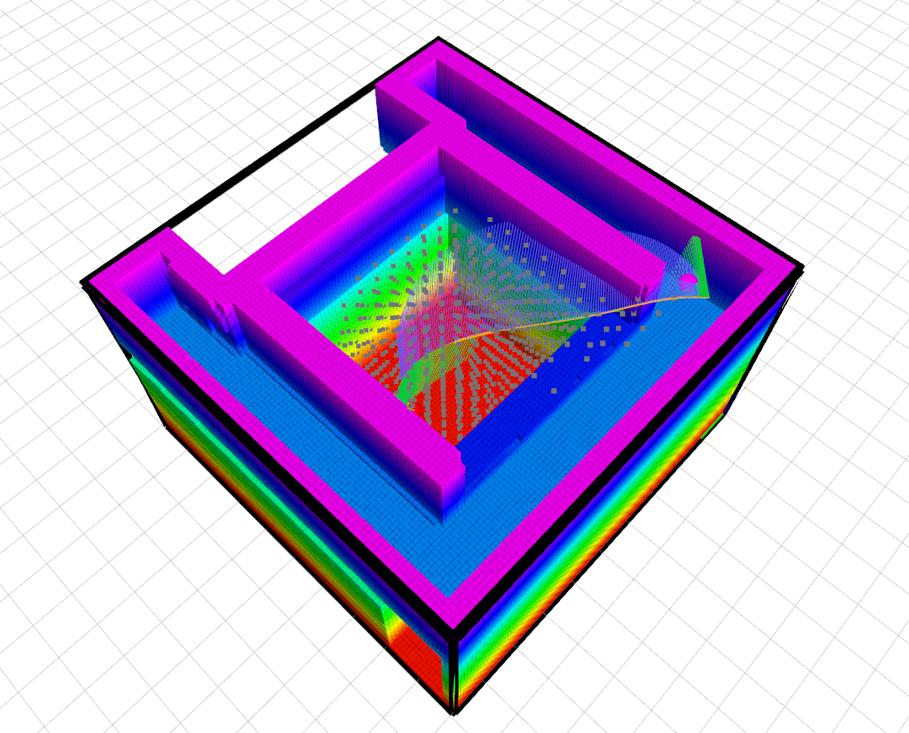
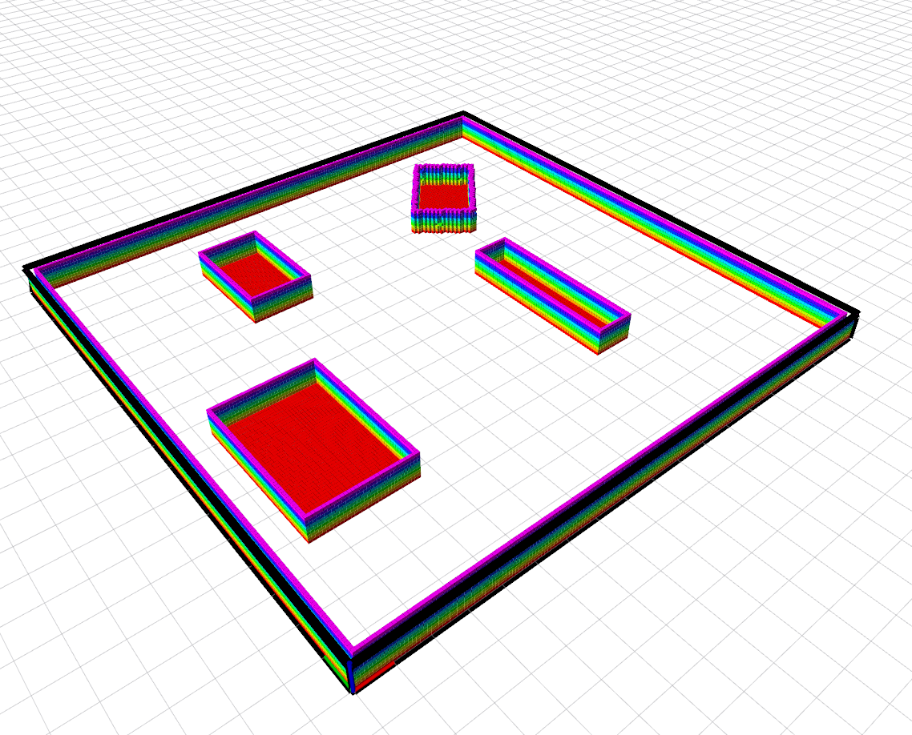
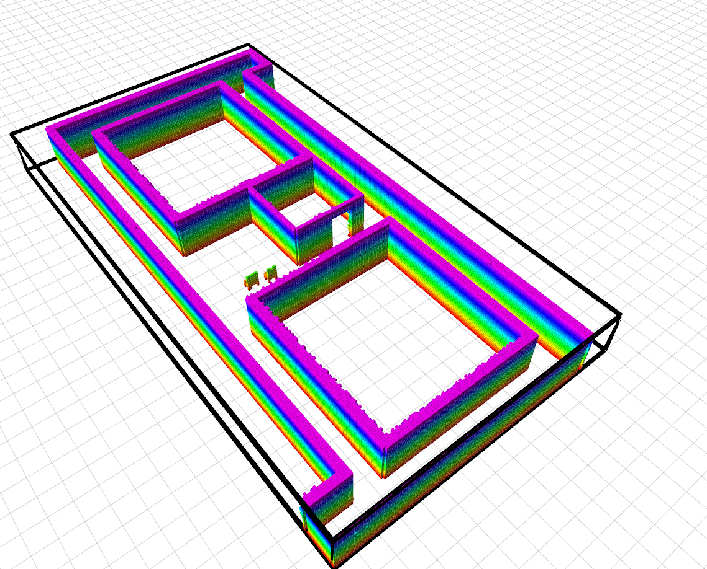
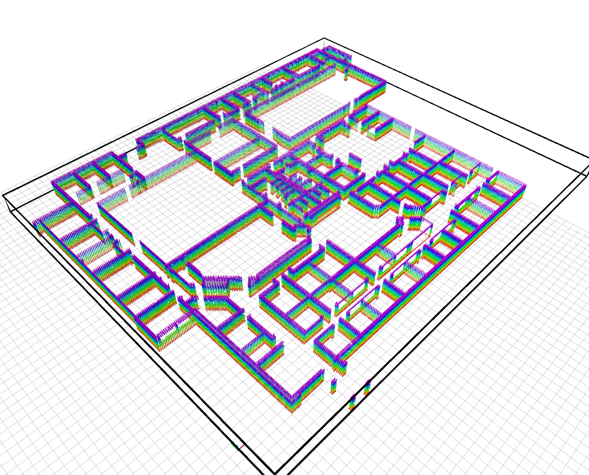

# MRSL Motion Primitive Library ROS
[](https://app.wercker.com/project/byKey/d282a628f39dac13997c792b2298bde0)
- - - 
A ROS wrapper for [Motion Primitive Library](https://sikang.github.io/motion_primitive_library/). Video of the original paper of "Search-based Motion Planning for Quadrotors using Linear Quadratic Minimum Time Control" has been uploaded at the follwing link: [youtube](https://youtu.be/LMe72buMky8).
The package is still under maintenance, the API may change occasionally, please use `git log` to track the latest update. 

Packages:
  - `motion_primitive_library`: back-end for planning trajectory in various environments
  - `planning_ros_msgs`: ROS msgs used in storing, visualizing and communicating 
  - `planning_ros_utils`: ROS utils for interfacing with MPL, it also includes mapping and rviz plugins
  - `mpl_test_node`: examples code for simple testing

## Installation
#### Prerequisite:
  - `ROS`(Indigo+)
  - [`catkin_simple`](https://github.com/catkin/catkin_simple)
  - [`DecompROS`](https://github.com/sikang/DecompROS)

If the submodule `motion_primitive_library` is not initialized yet, run following commands at first:
```sh
$ cd /PATH/TO/mpl_ros
$ git submodule update --init 
```

#### 1) Using Catkin:
```sh
$ mv mpl_ros ~/catkin_ws/src
$ cd ~/catkin_ws & catkin_make_isolated -DCMAKE_BUILD_TYPE=Release
```

#### 2) Using Catkin Tools (recommended):
```sh
$ mv mpl_ros ~/catkin_ws/src
$ catkin config -DCMAKE_BUILD_TYPE=Release
$ cd ~/catkin_ws & catkin build
```

## Usage
Simple test using the built-in data can be run using the following commands:
```sh
$ cd ./mpl_test_node/launch/test_primitive_map
$ roslaunch rviz.launch
$ roslaunch test.launch
```

If it runs succesfully, you should be able to see following print out:
```
[ INFO] [1517950714.592547755]: Get data!
[MPPlanner] PLANNER VERBOSE ON
[MPBaseUtil] set epsilon: 1.000000
[MPBaseUtil] set v_max: 2.000000
[MPBaseUtil] set a_max: 1.000000
[MPBaseUtil] set u_max: 1.000000
[MPBaseUtil] set dt: 1.000000
[MPBaseUtil] set max num: -1
[MPBaseUtil] set tol_dis: 1.000000
[MPBaseUtil] set tol_vel: 1.000000
[MPBaseUtil] set tol_acc: 1.000000
start pos: [12.500000, 1.400000, 0.000000], vel: [1.000000, 0.000000, 0.000000], acc: [0.000000, 0.000000, 0.000000]
goal pos: [6.400000, 16.600000, 0.000000], vel: [0.000000, 0.000000, 0.000000], acc: [0.000000, 0.000000, 0.000000]
[MPBaseUtil] set effort in acc
Start from new node!
goalNode fval: 111.258702, g: 97.000000!
Expand [277] nodes!
Reached Goal !!!!!!

t: 9 --> 8
g: 97.000000, rhs: inf, h: 14.258702
t: 8 --> 7
g: 86.000000, rhs: inf, h: 21.483618
t: 7 --> 6
g: 75.000000, rhs: inf, h: 28.925053
t: 6 --> 5
g: 65.000000, rhs: inf, h: 37.819469
t: 5 --> 4
g: 54.000000, rhs: inf, h: 47.751727
t: 4 --> 3
g: 44.000000, rhs: inf, h: 53.842936
t: 3 --> 2
g: 33.000000, rhs: inf, h: 63.910897
t: 2 --> 1
g: 22.000000, rhs: inf, h: 74.000250
t: 1 --> 0
g: 11.000000, rhs: inf, h: 80.954339
[ INFO] [1517950714.627870219]: Succeed! Takes 0.008684 sec for planning, expand [277] nodes
================== Traj -- total J: 7.000000, total time: 9.000000
================ Refined traj -- total J: 5.796949, total time: 9.000000
```

Another example using ellipsoid model can be found in `mpl_test_node/launch/test_primitive_cloud`, in which a point cloud is used as obstacles, and the robot is modeled as ellipsoid. More information can be found in the paper ["Search-based Motion Planning for Aggressive Flight in SE(3)"](http://ieeexplore.ieee.org/document/8264768/). 

The planned trajectory and voxel map are visualized in Rviz as:

   

## Use Maps
The built-in maps are listed as below:

Simple | Levine | Skir | Office
:----- | :----- | :--- | :-----
 | | | 

User can form their own maps using the `mapping_utils`, a launch file example is provided in `./mpl_test_node/launch/map_generator` for converting a STL file into voxel map. 
For details about the full utilities, please refer to [wiki](https://github.com/sikang/mpl_ros/wiki).

