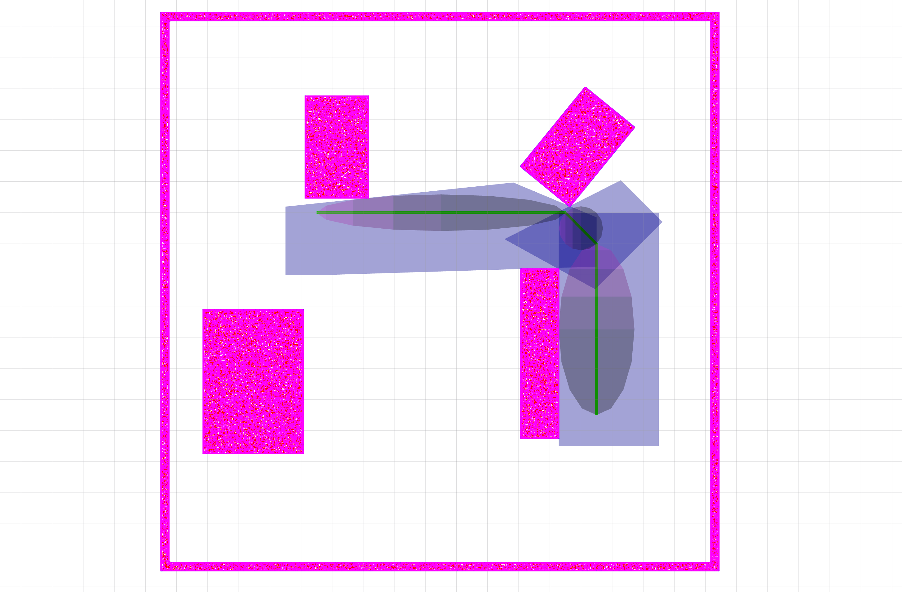
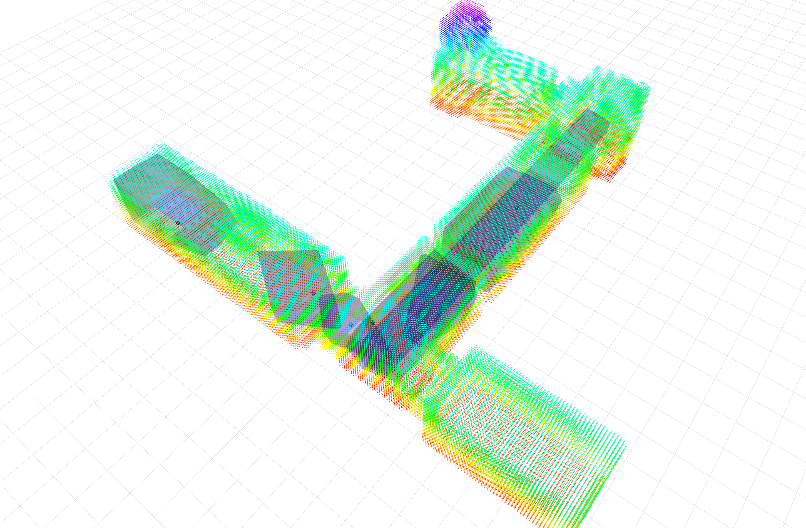

# MRSL Decomp Util ROS
[](https://app.wercker.com/project/byKey/d7ea0616ed5e23113099e84ec4289f6b)
- - -
A ROS wrapper for implementing [`DecompUtil`](https://github.com/sikang/DecompUtil.git), stacks include:
  - `DecompUtil`: convex decomposition of free space in a cluttered environment
  - `decomp_ros_msgs`: ROS msgs used for storing, visualizing and communicating
  - `decomp_ros_utils`: ROS utils for interfacing with `DecompUtil`
  - `decomp_test_node`: contains two example codes for testing

## Compilation
#### Prerequisite:
  - `ROS`(Indigo+)
  - [`catkin_simple`](https://github.com/catkin/catkin_simple)
  - `QT`(4+)

If the submodule `DecompUtil` is not initialized yet, run following commands at first:
```bash
$ cd /PATH/TO/DecompROS
$ git submodule update --init
```

#### 1) Using Catkin:
```bash
$ mv decomp_ros ~/catkin_ws/src
$ cd ~/catkin_ws & catkin_make_isolated -DCMAKE_BUILD_TYPE=Release
```

#### 2) Using Catkin Tools (Recommended):
```bash
$ mv decomp_ros ~/catkin_ws/src
$ catkin config -DCMAKE_BUILD_TYPE=Release
$ cd ~/catkin_ws & catkin build
```

## Usage
Simple test using the built-in data can be applied through following commands:
```bash
$ roscd test_node/launch
$ roslaunch rviz.launch
$ roslaunch test_path_decomp.launch
```

## Examples
The following images show results from `EllipsoidDecomp2D` and `SeedDecomp3D`:
 
