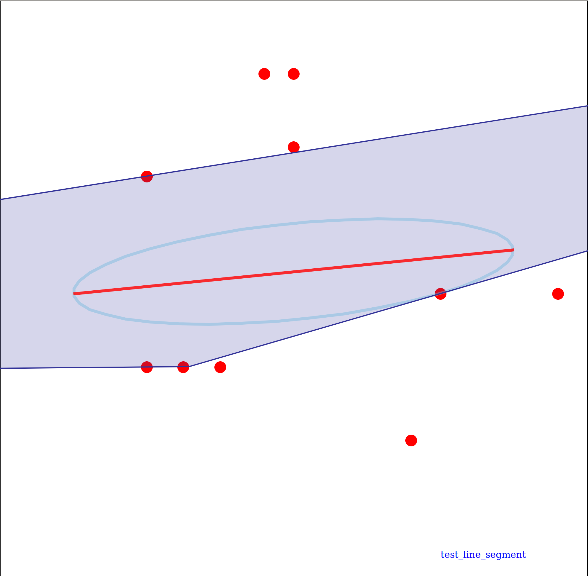
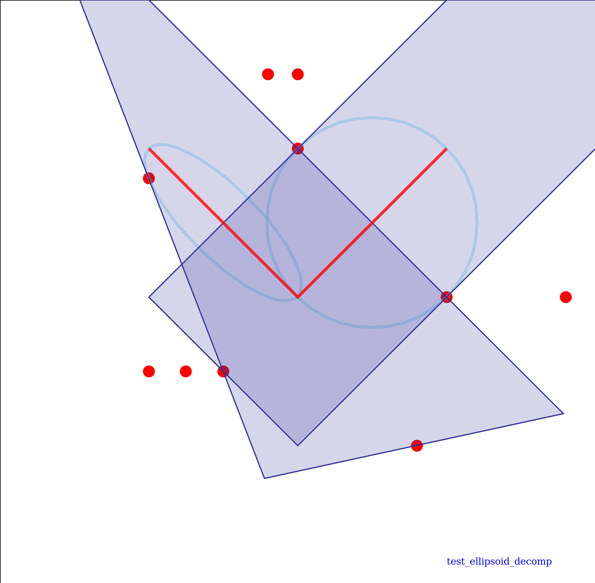

# MRSL Decomputil Library v1.0
[](https://app.wercker.com/project/byKey/89a66f8c94c00db95dc056bae099adb3)
- - -
A header only c++ library for fast convex decomposition. In the basic pipeline, it implements ellipsoid based regional inflation to model free space from a given path inside a point cloud.
Detials of the algorithm is proposed in ["S. Liu, M. Watterson, K. Mohta, K. Sun, S. Bhattacharya, C.J. Taylor and V. Kumar. Planning Dynamically Feasible Trajectories for Quadrotors using Safe Flight Corridors in 3-D Complex Environments. ICRA 2017"](http://ieeexplore.ieee.org/document/7839930/).

## Installation
DecompUtil is a header only library, several test nodes are compiled during the
installation.
#### A) Simple cmake
```bash
$ mkdir build && cd build && cmake .. && make
```

#### B) Using CATKIN (not recognizable by catkin\_make)
```bash
$ cd mv decomp_util ~/catkin_ws/src
$ cd ~/catkin_ws & catkin_make_isolated -DCMAKE_BUILD_TYPE=Release
```

#### CTest
To check if everything is installed properlly:
```bash
$ make test
```

#### Include in other projects:
To link this lib properly, add following in the `CMakeLists.txt`
```
find_package(decomp_util REQUIRED)
include_directories(${DECOMP_UTIL_INCLUDE_DIRS})
```

## Examples
The examples of using `SeedDecomp2D`, `LineSegment2D`, `EllipsoidDecomp2D` and
`IterativeDecomp2D` are plotted as followings:

SeedDecomp2D | LineSegment2D | EllipsoidDecomp2D | IterativeDecomp2D
:----------- | :------------ | :---------------- | :----------------
 |  |  | 


The corresponding code for testing can be found in the `test` folder.

## Doxygen
For more details, please refer to https://sikang.github.io/DecompUtil/index.html

## ROS
The ROS wrapper for easier use of this package can be found in [`DecompROS`](https://github.com/sikang/DecompROS.git).
